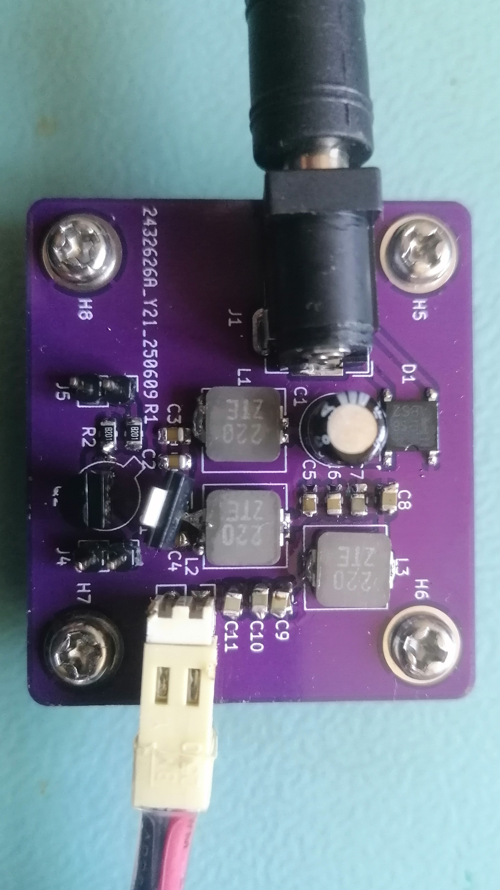
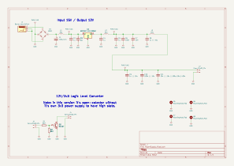

# Semiconductor Radioactivity Detector

## Summary

There are many ways to measure radioactivity levels. Semiconductor detectors sense interactions between ionizing radiation and a p-n junction. Since most hobbyists use Geiger-Muller-based detectors (which are lamp-based devices, not semiconductors), I think it's a cool idea to explore this semiconductor-based approach.

## System Architecture

### Additional sub-components used:

#### [Hardware Data Logger](https://github.com/RobertGawron/HardwareDataLogger)

A pulse counter based on the NUCLEO dev board, featuring an additional shield for real-time data display via an LCD. It also supports local data storage on an SD card, remote storage via WiFi, and direct transfer to a PC through USB.

#### [Auxiliary Board (Power Supply + Logic Level Converter)](./Hardware/PowerSupply/) 

An auxiliary board was developed later on to fix things that weren’t included on the original board (because it's easier to add a new board than to rework the whole device). This board isn’t really a successful one, but it does its job. It has:

**12V power supply (powered from a 15V wall adapter).** The device needs a very low-noise power supply. Originally, it was powered by a high-quality lab power supply. However, to make it more versatile, I tried using a cheap Chinese power supply and a power regulator. I chose the IC I had on hand (**NCP1117**), hoping it would do the job. It works, but it needs plenty—plenty—of capacitors to filter the voltage well enough. The values are updated on the schematic, but the PCB was left as-is.

**Logic level converter,** to convert logic levels from 12V (high) and 0V (low)—as output by the sensor—to 3.3V (high) and 0V (low), which is standard for STM32 and cheap Chinese logic analyzers. This part also works partially: there's no 3.3V power supply on the board, so the output is open-collector type. This causes issues when using cheap 3.3V logic analyzers, since they don't have an external Vcc pin. Also, instead of just a transistor, a comparator would probably be better here.

Overall, the auxiliary board works, but needs a complete rework.

## Hardware

The sensor circuit is presented below, and its picture was shown above.

[Sensor Assembly Instructions.](./Hardware/SemiconductorRadioactivityDetector/README.md)

The auxiliary board and its circuit are shown below.

PCB project was done in KiCAD.

## Software

[There are some Python and R scripts available](./Software/DataAcquisition/) for gathering data from the device. These were developed during the initial testing phase and may still be useful due to their simplicity.

In the future, the goal is to transition to using the [Hardware Data Logger](https://github.com/RobertGawron/HardwareDataLogger), which provides a more versatile and efficient way to collect measurements.

## Project History

 * [First Unsuccessful Attempts](https://robertgawron.blogspot.com/2016/12/semiconductor-radioactivity-detector.html)
semiconductor-radioactivity-detector.html) - the biggest issue was the lack of proper shielding. Due to the extremely high amplification levels, the device either failed to function or began oscillating uncontrollably without adequate shielding.
* [First Working Version](https://robertgawron.blogspot.com/2019/02/semiconductor-radioactivity-detector.html) - this was a simplified version of the current project. It lacked both polarization voltage and an ADC converter, but it laid the foundation for further improvements.
