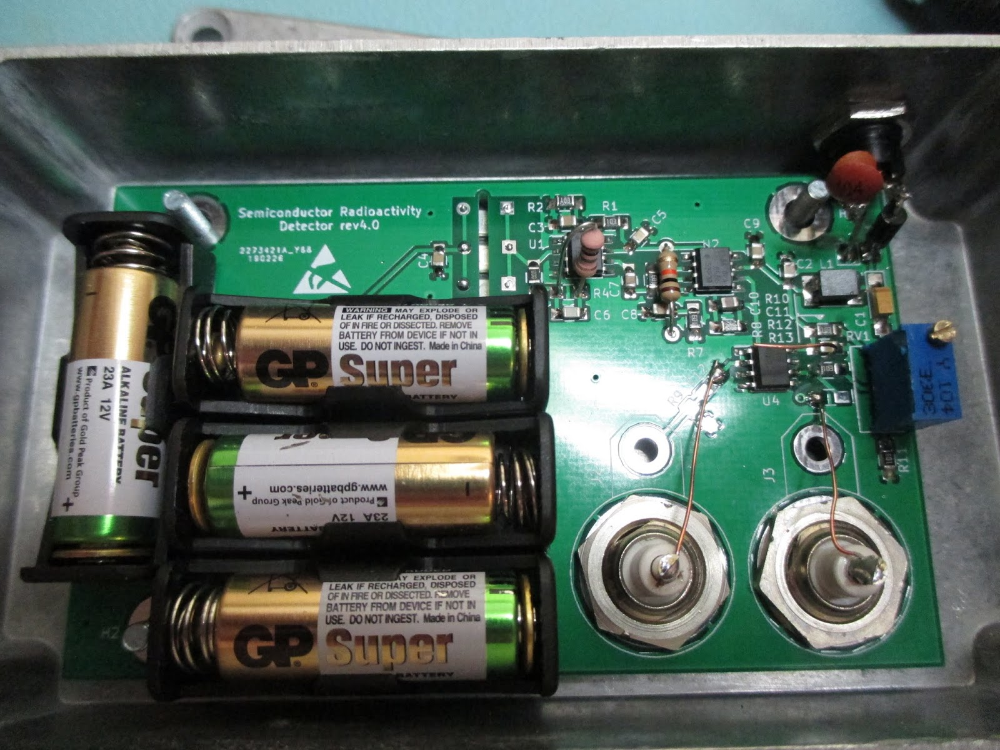
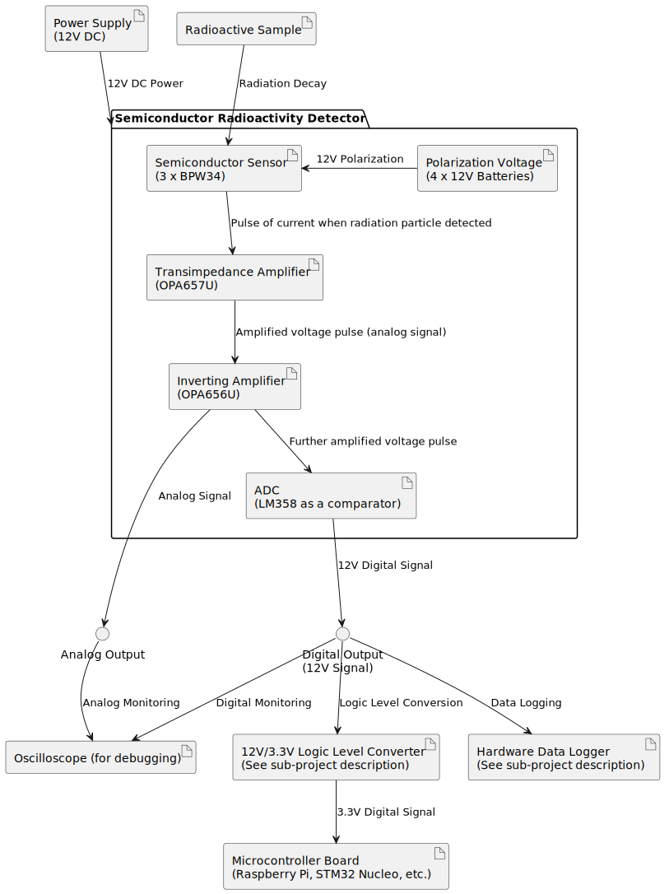
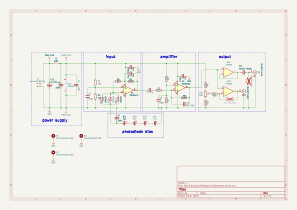
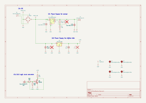

# Semiconductor Radioactivity Detector

## Summary

There are many ways to measure radioactivity levels. Semiconductor detectors sense interactions between ionizing radiation and a p-n junction. Since most hobbyists use Geiger-Muller-based detectors (which are lamp-based devices, not semiconductors), I think it's a cool idea to explore this semiconductor-based approach.

## System Architecture

## Additional sub-components used

### Hardware Data Logger

A pulse counter based on the STM32 and ESP chips that can send the measurements via WiFi for further processing, store them on an SD card, or display them to the user. This is an [open-source and open-hardware project that I created, available on GitHub.](https://github.com/RobertGawron/HardwareDataLogger)

### Auxiliary Board (Power Supply + Logic Level Converter)

An auxiliary board was developed later on to fix things that weren’t included on the original board (because it's easier to add a new board than to rework the whole device). This board isn’t really a successful one, but it does its job. It has:

**12V power supply (powered from a 15V wall adapter).** The device needs a very low-noise power supply. Originally, it was powered by a high-quality lab power supply. However, to make it more versatile, I tried using a cheap Chinese power supply and add a board with a power regulator. 

In the first revision, I chose the NCP1117 stabiliser, but it was too noisy. This caused the sensor's output to oscillate randomly, which made the device rather pointless. I made it work by adding plenty of capacitors on the input and output, though this was always a temporary solution. 

In the new version, I will be replacing it with the TPS7A2601DRVR.

**Logic level converter,** to convert logic levels from 12V (high) and 0V (low)—as output by the sensor—to 3.3V (high) and 0V (low), which is standard for STM32 and cheap Chinese logic analyzers. 

In the first version, I just used an open-collector configuration, but this made the device unable to work directly with cheap 3.3V logic analyzers, which need either 0V (low state) or 3.3V (high state).

In the new version, I added a cheap 3.3V stabiliser to provide the correct high state.

## Hardware

All hardware was done using KiCad.

The sensor assembly needs care, as this device is extremely sensitive; [more details are presented in this README.](./Hardware/SemiconductorRadioactivityDetector/README.md)

The sensor circuit is shown below.

The new design of the auxiliary board is shown below, integrated with the whole device. It's the small PCB on the right side of the image. The render was done using Blender.

Circuit of the Auxiliary Board is shown below.

## Mechanic

Before ordering PCBs and the 3D print for the auxiliary holder, how could I be sure everything would fit? Instead of redoing things many times, I took the model of the old PCB, the new PCB that would be the addition to it, the 3D holder, and the metal enclosure (which is a popular consumer enclosure), placed them all accordingly in Blender, and checked if everything fit.

[The needed tools and the workflow are presented in this README.](./Mechanic/README.md)

## Software

[There are some Python and R scripts available](./Software/DataAcquisition/) for gathering data from the device. These were developed during the initial testing phase and may still be useful due to their simplicity.

In the future, the goal is to transition to using the [Hardware Data Logger](https://github.com/RobertGawron/HardwareDataLogger), which provides a more versatile and efficient way to collect measurements.

## Project History

 * [First Unsuccessful Attempts](https://robertgawron.blogspot.com/2016/12/semiconductor-radioactivity-detector.html)
semiconductor-radioactivity-detector.html) - the biggest issue was the lack of proper shielding. Due to the extremely high amplification levels, the device either failed to function or began oscillating uncontrollably without adequate shielding.
* [First Working Version](https://robertgawron.blogspot.com/2019/02/semiconductor-radioactivity-detector.html) - this was a simplified version of the current project. It lacked both polarization voltage and an ADC converter, but it laid the foundation for further improvements.
