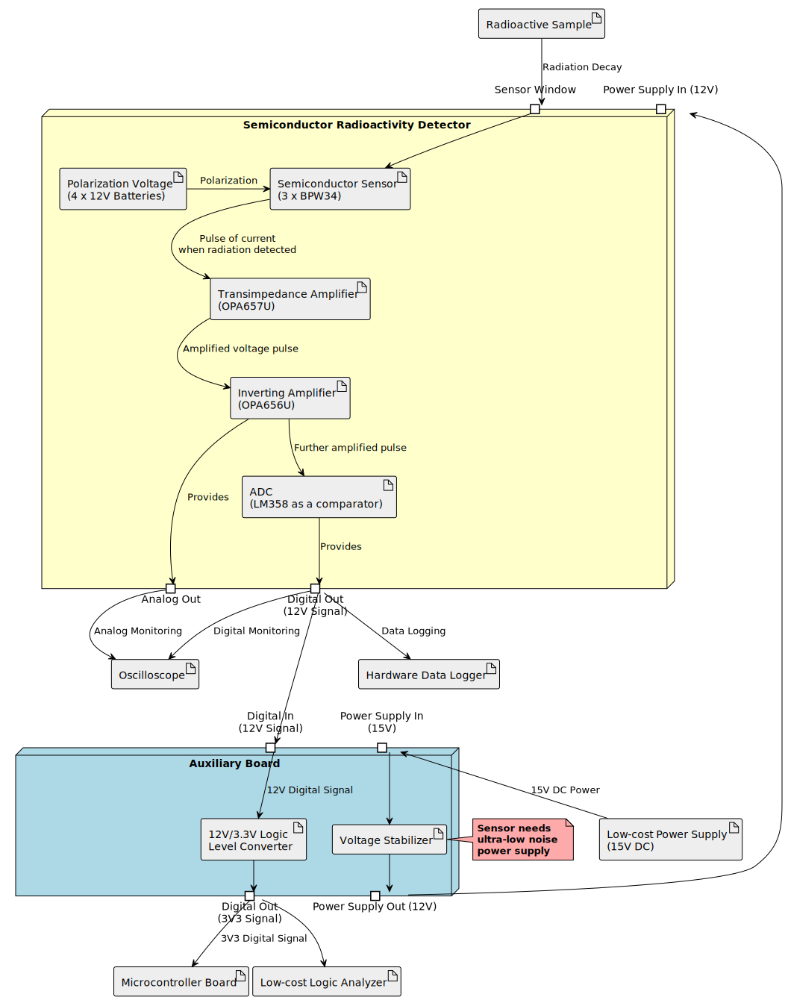

# Semiconductor Radioactivity Detector

## Summary

There are many ways to measure radioactivity levels. Semiconductor detectors sense interactions between ionizing radiation and a p-n junction. Since most hobbyists use Geiger-Muller-based detectors (which are lamp-based devices, not semiconductors), I think it's a cool idea to explore this semiconductor-based approach.

## System Architecture

### Additional sub-components used:

* [Hardware Data Logger](https://github.com/RobertGawron/HardwareDataLogger) - a pulse counter based on the NUCLEO dev board, featuring an additional shield for real-time data display via an LCD. It also supports local data storage on an SD card, remote storage via WiFi, and direct transfer to a PC through USB.
* [Logic Level Converter](./Hardware/LogicLevelConverter/README.md) - for interfacing with boards that use 3.3V as the high logic level (all modern dev boards). Without this converter, directly connecting the signal from the detector to a GPIO pin would burn the GPIO.

## Hardware

PCB project was done in KiCAD.

[Device Assembly Instructions.](./Hardware/SemiconductorRadioactivityDetector/README.md)

## Software

[There are some Python and R scripts available](./Software/DataAcquisition/) for gathering data from the device. These were developed during the initial testing phase and may still be useful due to their simplicity.

In the future, the goal is to transition to using the [Hardware Data Logger](https://github.com/RobertGawron/HardwareDataLogger), which provides a more versatile and efficient way to collect measurements.

## Project History

 * [First Unsuccessful Attempts](https://robertgawron.blogspot.com/2016/12/semiconductor-radioactivity-detector.html)
semiconductor-radioactivity-detector.html) - the biggest issue was the lack of proper shielding. Due to the extremely high amplification levels, the device either failed to function or began oscillating uncontrollably without adequate shielding.
* [First Working Version](https://robertgawron.blogspot.com/2019/02/semiconductor-radioactivity-detector.html) - this was a simplified version of the current project. It lacked both polarization voltage and an ADC converter, but it laid the foundation for further improvements.
